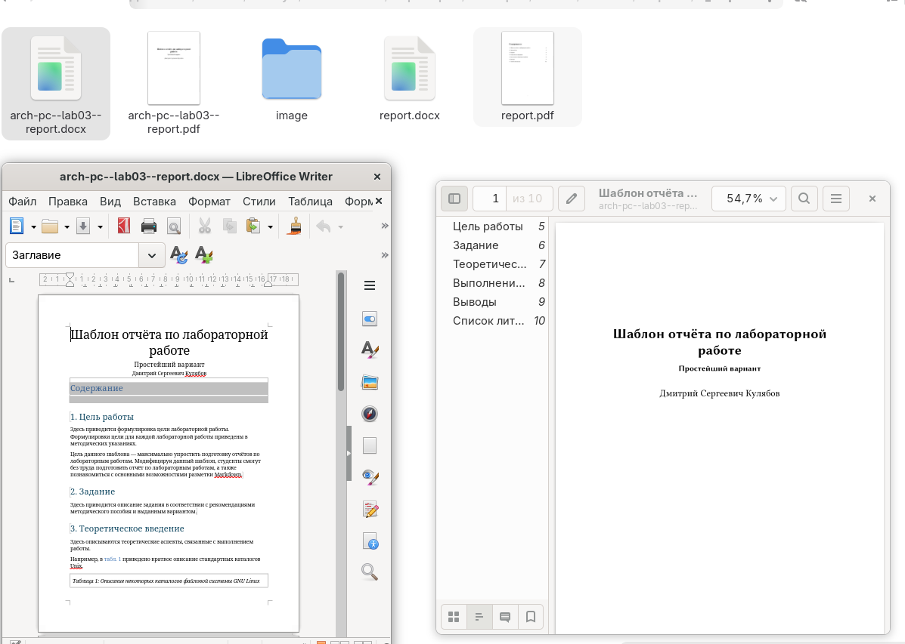
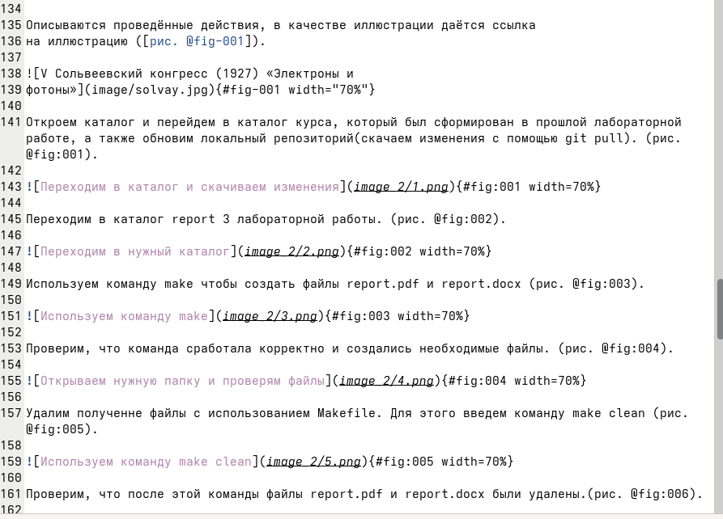
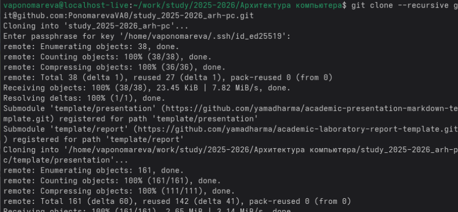
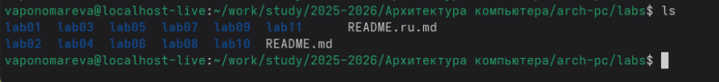

---
## Front matter
title: "Отчёт по лабораторной работе №3"
subtitle: "Язык разметки Markdown"
author: "Пономарева Варвара Александровна"

## Generic otions
lang: ru-RU
toc-title: "Содержание"

## Pdf output format
toc: true # Table of contents
toc-depth: 2
lof: true # List of figures
lot: false
fontsize: 13pt
linestretch: 1.5
papersize: a4
documentclass: scrreprt
## I18n polyglossia
polyglossia-lang:
  name: russian
  options:
   - spelling=modern
   - babelshorthands=true
polyglossia-otherlangs:
  name: english
## I18n babel
babel-lang: russian
babel-otherlangs: english
## Fonts
## Pandoc-crossref LaTeX customization
figureTitle: "Рис."
tableTitle: "Таблица"
listingTitle: "Листинг"
lofTitle: "Список иллюстраций"
lolTitle: "Листинги"
## Misc options
indent: true
header-includes:
  - \usepackage{indentfirst}
  - \usepackage{float} # keep figures where there are in the text
  - \floatplacement{figure}{H} # keep figures where there are in the text
---
# Цель работы

Ознакомиться с языком разметки Markdown и оформить отчет по лабораторной работе №2 в ней.

# Задание

Сформировать отчет по лабораторной работе №2 с помощью Markdown.

# Теоретическое введение

Чтобы задать для текста полужирное начертание, заключите его в двойные звездочки:
This text is **bold**.

Чтобы задать для текста курсивное начертание, заключите его в одинарные звездочки:
This text is *italic*.

Чтобы задать для текста полужирное и курсивное начертание, заключите его в тройные звездочки:
This is text is both ***bold and italic***.

Блоки цитирования создаются с помощью символа >:

> The drought had lasted now for ten million years, and the reign of the terrible lizards had long since ended. Here on the Equator, in the continent which would one day be known as Africa, the battle for existence had reached a new climax of ferocity, and the victor was not yet in sight. In this barren and desiccated land, only the small or the swift or the fierce could flourish, or even hope to survive.

Упорядоченный список можно отформатировать с помощью соответствующих цифр:

1. First instruction
   1. Sub-instruction
   1. Sub-instruction
1. Second instruction

Чтобы вложить один список в другой, добавьте отступ для элементов дочернего списка:

1. First instruction
   1. Second instruction
      1. Third instruction

Неупорядоченный (маркированный) список можно отформатировать с помощью звездочек или тире:

* List item 1
* List item 2
* List item 3

Чтобы вложить один список в другой, добавьте отступ для элементов дочернего списка:

- List item 1
  - List item A
  - List item B
- List item 2

Синтаксис Markdown для встроенной ссылки состоит из части [link text], представляющей текст гиперссылки, и части (file-name.md) – URL-адреса или имени файла, на который дается ссылка:

[link text](file-name.md)

или

[link text](http://example.com/ "Необязательная подсказка")

# Выполнение лабораторной работы

Откроем каталог и перейдем в каталог курса, который был сформирован в прошлой лабораторной работе, а также обновим локальный репозиторий(скачаем изменения с помощью git pull).([рис. @fig-001]).

{#fig-001 width=70%}

Переходим в каталог report 3 лабораторной работы. ([рис. @fig-002]).

{#fig-002 width=70%}

Используем команду make чтобы создать файлы report.pdf и report.docx.([рис. @fig-003]).

{#fig-003 width=70%}

Проверим, что команда сработала корректно и создались необходимые файлы. ([рис. @fig-004]).

{#fig-004 width=70%}

Удалим полученне файлы с использованием Makefile. Для этого введем команду make clean. ([рис. @fig-005]).

{#fig-005 width=70%}

Проверим, что после этой команды файлы report.pdf и report.docx были удалены. ([рис. @fig-006]).

{#fig-006 width=70%}

Откроем файл report.md c помощью любого текстового редактора, например gedit. ([рис. @fig-007]).

{#fig-007 width=70%}

Далее внимательно изучаем открывшийся файл. ([рис. @fig-008]).

{#fig-008 width=70%}

Начинаем заполнять отчет и изменять файл. ([рис. @fig-009]).

{#fig-009 width=70%}

# Самостоятельная работа. Отчет по лабораторной работе №2. 

Сначала делаем предварительную конфигурацию git. ([рис. @fig-sr-001]).

{#fig-sr-001 width=70%}

Настроим utf-8 в выводе сообщений git. ([рис. @fig-sr-002]).

{#fig-sr-002 width=70%}

Зададим имя начальной ветки (будем называть её master). ([рис. @fig-sr-003]).

{#fig-sr-003 width=70%}

Параметр autocrlf определяет, как Git будет обрабатывать концы строк при добавлении файлов в индекс и при выгрузке файлов из индекса. Значение input означает, что Git будет преобразовывать концы строк в формат LF (Unix-style) при добавлении файлов в индекс, но не будет выполнять никаких преобразований при выгрузке файлов из индекса. ([рис. @fig-sr-004]).

{#fig-sr-004 width=70%}

Настройка core.safecrlf warn определяет, как Git будет реагировать на различные форматы концов строк в файлах. Значение warn означает, что Git будет выдавать предупреждение, если в файле обнаружены смешанные концы строк. ([рис. @fig-sr-005]).

{#fig-sr-005 width=70%}

Для последующей идентификации пользователя на сервере репозиториевсгенерируем пару ключей (приватный и открытый) с помощью команды ssh-keygen. ([рис. @fig-sr-006]).

{#fig-sr-006 width=70%}

Копируем сгенерированный ключ в буфер обмена с помощью команды xclip. ([рис. @fig-sr-007]).

{#fig-sr-007 width=70%}

Заходим в аккаунт на github, переходим в настройки и добавляем новый SSH-ключ. ([рис. @fig-sr-008]).

{#fig-sr-008 width=70%}

Проверим наличие созданного ключа в профиле. ([рис. @fig-sr-009]).

{#fig-sr-009 width=70%}

Создадим каталог для предмета «Архитектура компьютера» с нужным названием. ([рис. @fig-sr-010]).

{#fig-sr-010 width=70%}

Переходим на страницу репозитория с шаблоном курса и с помощью use this template создаем репозиторий. ([рис. @fig-sr-011]).

{#fig-sr-011 width=70%}

Далее переходим в каталог курса. ([рис. @fig-sr-012]).

{#fig-sr-012 width=70%}

Клонируем созданный репозиторий с помощью команды git clone. ([рис. @fig-sr-013]).

{#fig-sr-013 width=70%}

Перейдем в каталог курса. ([рис. @fig-sr-014]).

{#fig-sr-014 width=70%}

Создадим там каталоги с помощью команд echo arch-pc > COURSE и make prepare. ([рис. @fig-sr-015]).

{#fig-sr-015 width=70%}

Добавляем все измененные файлы с помощью команды git add для последующего коммита и записываем изменения в репозиторий. ([рис. @fig-sr-016]).

{#fig-sr-016 width=70%}

Отправляем данные в репозиторий с помощью команды git push. ([рис. @fig-sr-017]).

{#fig-sr-017 width=70%}

Проверим выполнение команд с помощью команды ls и просмотрим файлы. ([рис. @fig-sr-018]).

{#fig-sr-018 width=70%}

Создадим отчет по выполнению лабораторной работы в соответствующем каталоге рабочего пространства (labs/lab02/report) с помощью touch. Проверим, что документ с отчетом находится в папке (с помощью команды ls). ([рис. @fig-sr-019]).

{#fig-sr-019 width=70%}

Скопируем отчет по выполнению предыдущей лабораторной работы в соответствующий каталог созданного рабочего пространства. Используем команду mv, чтобы переместить файл и команду ls, чтобы проверить его наличие в нужном каталоге. ([рис. @fig-sr-020]).

{#fig-sr-020 width=70%}

Отправим файлы на github с помощью команды git add и добавим описание выполненyого действия с помощью команды commit -m. ([рис. @fig-sr-021]).

{#fig-sr-021 width=70%}

Также подтвердим все с помощью git push. ([рис. @fig-sr-022]).

{#fig-sr-022 width=70%}

Таким образом, мы приобрели практические навыки работы с операционной системой Linux на уровне командной строки, а именно организации файловой системы, навигации по файловой системе, создании и удалении файлов и директорий.

# Выводы

Мы познакомились с языком разметки Markdown и оформили отчет в ней и
загрузили на Github.

