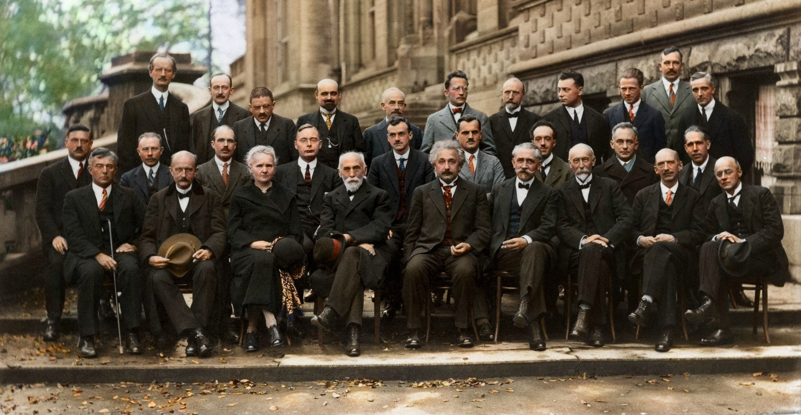

# Шаблон отчёта по лабораторной работе
Дмитрий Сергеевич Кулябов

- [1 Цель работы](#цель-работы)
- [2 Задание](#задание)
- [3 Теоретическое
  введение](#теоретическое-введение)
- [4 Выполнение лабораторной
  работы](#выполнение-лабораторной-работы)
- [5 Выводы](#выводы)
- [Список литературы](#список-литературы)

# Цель работы

Здесь приводится формулировка цели лабораторной работы. Формулировки
цели для каждой лабораторной работы приведены в методических указаниях.

Цель данного шаблона — максимально упростить подготовку отчётов по
лабораторным работам. Модифицируя данный шаблон, студенты смогут без
труда подготовить отчёт по лабораторным работам, а также познакомиться с
основными возможностями разметки Markdown.

# Задание

Здесь приводится описание задания в соответствии с рекомендациями
методического пособия и выданным вариантом.

# Теоретическое введение

Здесь описываются теоретические аспекты, связанные с выполнением работы.

Например, в <a href="#tbl-std-dir" class="quarto-xref">табл. 1</a>
приведено краткое описание стандартных каталогов Unix.

| Имя каталога | Описание каталога                                                                                                          |
|--------------|----------------------------------------------------------------------------------------------------------------------------|
| `/`          | Корневая директория, содержащая всю файловую                                                                               |
| `/bin`       | Основные системные утилиты, необходимые как в однопользовательском режиме, так и при обычной работе всем пользователям     |
| `/etc`       | Общесистемные конфигурационные файлы и файлы конфигурации установленных программ                                           |
| `/home`      | Содержит домашние директории пользователей, которые, в свою очередь, содержат персональные настройки и данные пользователя |
| `/media`     | Точки монтирования для сменных носителей                                                                                   |
| `/root`      | Домашняя директория пользователя `root`                                                                                    |
| `/tmp`       | Временные файлы                                                                                                            |
| `/usr`       | Вторичная иерархия для данных пользователя                                                                                 |

Более подробно про Unix см. в \[1–4\].

# Выполнение лабораторной работы

Описываются проведённые действия, в качестве иллюстрации даётся ссылка
на иллюстрацию (<a href="#fig-001" class="quarto-xref">рис. 1</a>).

# Выводы

Здесь кратко описываются итоги проделанной работы.

# Список литературы

1.
Таненбаум Э., Бос Х. Современные
операционные системы. 4-е изд. СПб.: Питер, 2015. 1120 с.

2.
Robbins A. Bash Pocket Reference.
O’Reilly Media, 2016. 156 с.

3.
Zarrelli G. Mastering Bash. Packt
Publishing, 2017. 502 с.

4.
Newham C. [Learning the bash
Shell: Unix Shell
Programming](http://www.amazon.com/Learning-bash-Shell-Programming-Nutshell/dp/0596009658).
O’Reilly Media, 2005. 354 с.

