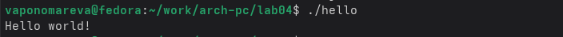
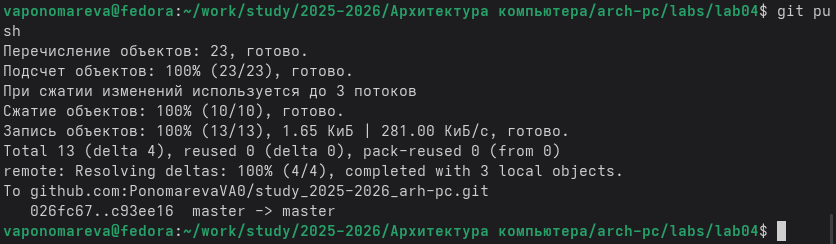

---
## Front matter
title: "Отчёта по лабораторной работе №4"
subtitle: "Создание и процесс обработки программ на языке ассемблера NASM"
author: "Пономарева Варвара Александровна"

## Generic otions
lang: ru-RU
toc-title: "Содержание"

## Bibliography
bibliography: bib/cite.bib
csl: pandoc/csl/gost-r-7-0-5-2008-numeric.csl

## Pdf output format
toc: true # Table of contents
toc-depth: 2
lof: true # List of figures
lot: false
fontsize: 12pt
linestretch: 1.5
papersize: a4
documentclass: scrreprt
## I18n polyglossia
polyglossia-lang:
  name: russian
  options:
   - spelling=modern
   - babelshorthands=true
polyglossia-otherlangs:
  name: english
## I18n babel
babel-lang: russian
babel-otherlangs: english
## Fonts
mainfont: Liberation Serif
sansfont: Liberation Sans
monofont: Liberation Mono
mainfontoptions: Ligatures=TeX
romanfontoptions: Ligatures=TeX
sansfontoptions: Ligatures=TeX,Scale=MatchLowercase
monofontoptions: Scale=MatchLowercase,Scale=0.9
## Biblatex
biblatex: true
biblio-style: "gost-numeric"
biblatexoptions:
  - parentracker=true
  - backend=biber
  - hyperref=auto
  - language=auto
  - autolang=other*
  - citestyle=gost-numeric
## Pandoc-crossref LaTeX customization
figureTitle: "Рис."
listingTitle: "Листинг"
lofTitle: "Список иллюстраций"
lolTitle: "Листинги"
## Misc options
indent: true
header-includes:
  - \usepackage{indentfirst}
  - \usepackage{float} # keep figures where there are in the text
  - \floatplacement{figure}{H} # keep figures where there are in the text
---
# Цель работы

Освоить процедуры компиляции и сборки программ и познакомиться с языком ассемблера NASM.

# Задание

Написать 2 программы (Hello world, lab4(Имя Фамилия))

# Теоретическое введение

Взаимодействие этих устройств осуществляется через общую шину, к которой они подклю-
чены. Физически шина представляет собой большое количество проводников, соединяющих
устройства друг с другом. В современных компьютерах проводники выполнены в виде элек-
тропроводящих дорожек на материнской (системной) плате.
Основной задачей процессора является обработка информации, а также организация
координации всех узлов компьютера. В состав центрального процессора (ЦП) входят
следующие устройства:

* арифметико-логическое устройство (АЛУ) — выполняет логические и арифметиче-
ские действия, необходимые для обработки информации, хранящейся в памяти;
* устройство управления (УУ) — обеспечивает управление и контроль всех устройств
компьютера;
* регистры — сверхбыстрая оперативная память небольшого объёма, входящая в со-
став процессора, для временного хранения промежуточных результатов выполнения
инструкций; регистры процессора делятся на два типа: регистры общего назначения и
специальные регистры.

Доступ к регистрам осуществляется не по адресам, как к основной памяти, а по именам.
Каждый регистр процессора архитектуры x86 имеет свое название, состоящее из 2 или 3
букв латинского алфавита.

В качестве примера приведем названия основных регистров общего назначения (именно
эти регистры чаще всего используются при написании программ):

* RAX, RCX, RDX, RBX, RSI, RDI — 64-битные
* EAX, ECX, EDX, EBX, ESI, EDI — 32-битные
* AX, CX, DX, BX, SI, DI — 16-битные
* AH, AL, CH, CL, DH, DL, BH, BL — 8-битные (половинки 16-битных регистров). Например,
AH (high AX) — старшие 8 бит регистра AX, AL (low AX) — младшие 8 бит регистра AX.

# Выполнение лабораторной работы

## Программа Hello world!

Создадим каталог для работы с программами на языке ассемблера NASM и перейдем в созданный каталог. ([рис. @fig-001]).

{#fig-001 width=70%}

Создадим текстовый файл с именем hello.asm. ([рис. @fig-002]).

{#fig-002 width=70%}

Открываем этот файл в текстовом редакторе. ([рис. @fig-003]).

{#fig-003 width=70%}

## Транаслятор NASM

Преобразуем текст программы в объектный код. ([рис. @fig-004]).

{#fig-004 width=70%}

Проверяем создался ли объектный файл с помощью команды ls. ([рис. @fig-005]).

{#fig-005 width=70%}

## Расширенный синтаксис командной строки NASM

Компилируем исходный файл hello.asm в obj.o. ([рис. @fig-006]).

{#fig-006 width=70%}

Проверяем, как сработала команда. ([рис. @fig-007]).

{#fig-007 width=70%}

## Компоновщик LD

Передаем объектный файл на обработку компоновщику. ([рис. @fig-008]).

{#fig-008 width=70%}

Проверяем создался ли исполняемый файл hello. ([рис. @fig-009]).

{#fig-009 width=70%}

Передаем объектный файл на обработку компоновщику. ([рис. @fig-010]).

{#fig-010 width=70%}

Проверяем создался ли исполняемый файл main. ([рис. @fig-011]).

{#fig-011 width=70%}

## Запуск исполняемого файла

Запускаем созданный исполняемый файл. ([рис. @fig-012]).

{#fig-012 width=70%}

## Задание для самостоятельной работы

Создаем копию файла hello.asm с именем lab4.asm. ([рис. @fig-013]).

{#fig-013 width=70%}

Открываем файл. ([рис. @fig-014]).

{#fig-014 width=70%}

Редактируем его, чтобы выводилось имя и фамилия. ([рис. @fig-015]).

{#fig-015 width=70%}

Прописывем те же команды, что и с первой программой. ([рис. @fig-016]).

{#fig-016 width=70%}

Копируем файлы в локальный репозиторий. ([рис. @fig-017]).

{#fig-017 width=70%}

Переходим в каталог лабораторных работ и загружаем файлы на Github. ([рис. @fig-018]).

{#fig-018 width=70%}

# Выводы

Мы познакомились с языком ассемблера NASM и написали две программы, которые выводят нужный текст.
