---
## Front matter
title: "Отчёта по лабораторной работе №5"
subtitle: "Основы работы с Midnight Commander"
author: "Пономарева Варвара Александровна"

## Generic otions
lang: ru-RU
toc-title: "Содержание"

## Bibliography
bibliography: bib/cite.bib
csl: _resources/csl/gost-r-7-0-5-2008-numeric.csl

## Pdf output format
toc: true # Table of contents
toc-depth: 2
lof: true # List of figures
lot: false
fontsize: 12pt
linestretch: 1.5
papersize: a4
documentclass: scrreprt
## I18n polyglossia
polyglossia-lang:
  name: russian
  options:
   - spelling=modern
   - babelshorthands=true
polyglossia-otherlangs:
  name: english
## I18n babel
babel-lang: russian
babel-otherlangs: english
## Fonts
mainfont: Liberation Serif
sansfont: Liberation Sans
monofont: Liberation Mono
mainfontoptions: Ligatures=TeX
romanfontoptions: Ligatures=TeX
sansfontoptions: Ligatures=TeX,Scale=MatchLowercase
monofontoptions: Scale=MatchLowercase,Scale=0.9
## Biblatex
biblatex: true
biblio-style: "gost-numeric"
biblatexoptions:
  - parentracker=true
  - backend=biber
  - hyperref=auto
  - language=auto
  - autolang=other*
  - citestyle=gost-numeric
## Pandoc-crossref LaTeX customization
figureTitle: "Рис."
listingTitle: "Листинг"
lofTitle: "Список иллюстраций"
lolTitle: "Листинги"
## Misc options
indent: true
header-includes:
  - \usepackage{indentfirst}
  - \usepackage{float} # keep figures where there are in the text
  - \floatplacement{figure}{H} # keep figures where there are in the text
---
# Цель работы

Приобрести практические навыки работы в Midnight Commander. Освоить инструкции
языка ассемблера mov и int.

# Задание

Написать 2 программы по примеру и изменить их, чтобы выполнялись нужные действия.

# Выполнение лабораторной работы

## Порядок выполнения лабораторной работы

Открываем Midnight Commander. ([рис. @fig-001]).

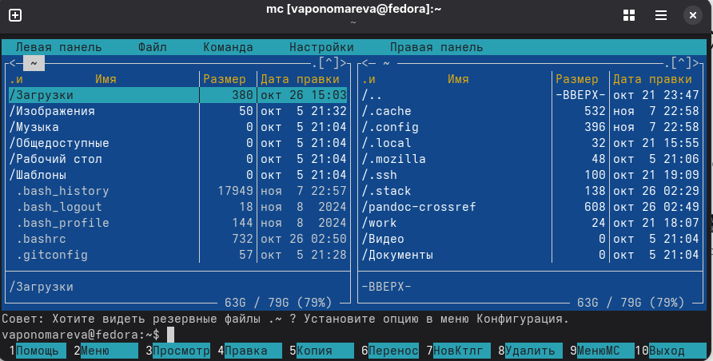{#fig-001 width=70%}

Переходим в каталог, который создали при выполнении 4 ЛБ. ([рис. @fig-002]).

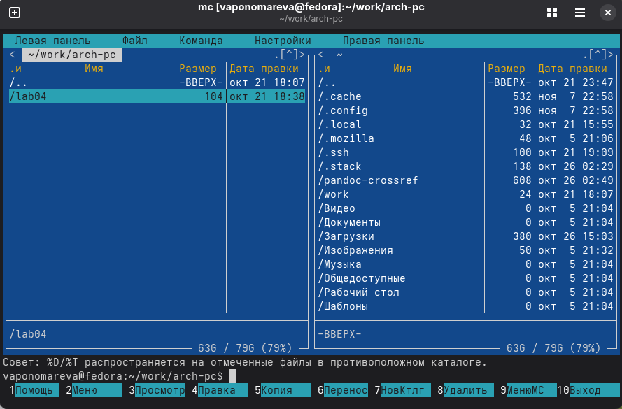{#fig-002 width=70%}

С помощью функциональной клавиши F7 создаем папку lab05. ([рис. @fig-003]).

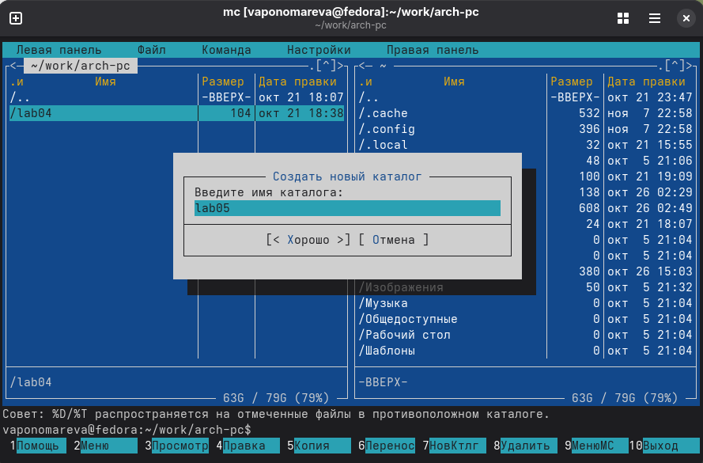{#fig-003 width=70%}

Пользуясь строкой ввода и командой touch создайдим файл lab5-1.asm . ([рис. @fig-004]).

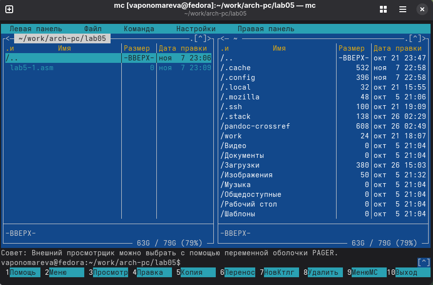{#fig-004 width=70%}

Открываем файл для редактирования и заполняем его по листингу. ([рис. @fig-005]).

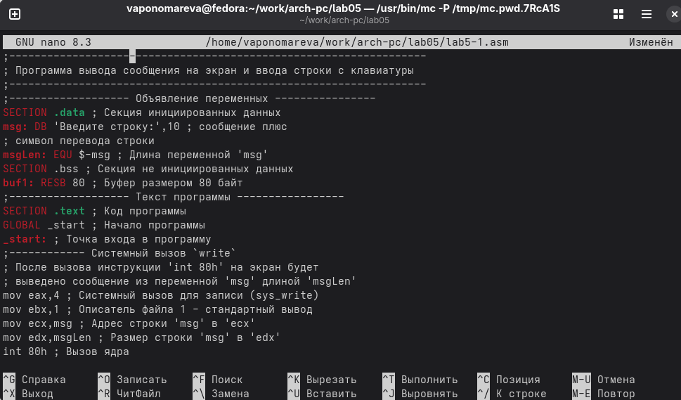{#fig-005 width=70%}

Открывем файл для просмотра. ([рис. @fig-006]).

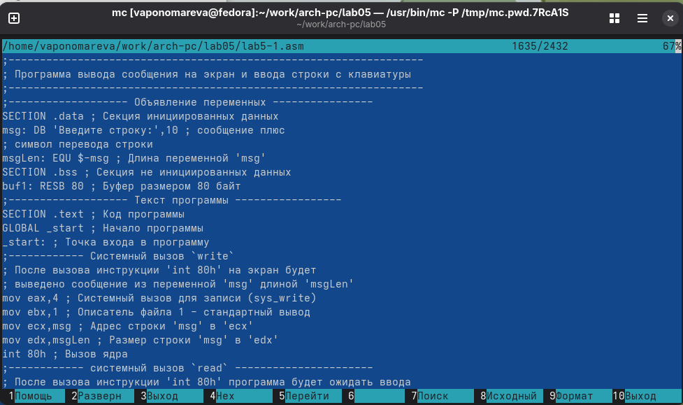{#fig-006 width=70%}

Оттранслируем текст программы lab5-1.asm в объектный файл и выполним компо-
новку объектного файла и запустим получившийся исполняемый файл. ([рис. @fig-007]).

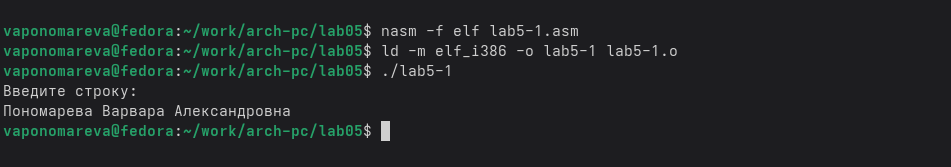{#fig-007 width=70%}

Скачиваем файл из ТУИС. ([рис. @fig-008]).

{#fig-008 width=70%}

Копируем файл в нужную директорию. ([рис. @fig-009]).

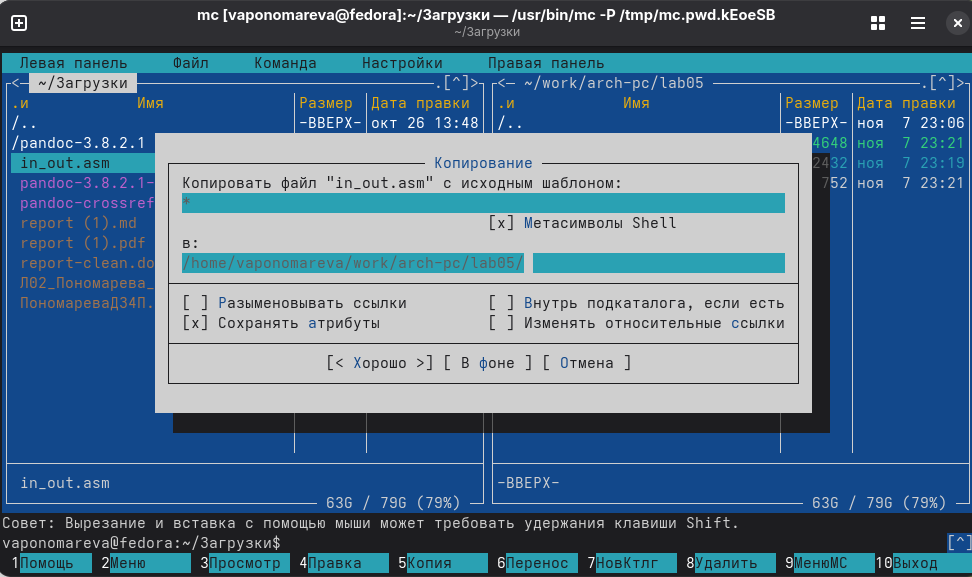{#fig-009 width=70%}

Создадим копию файла lab5-1.asm и назовем его lab5-2.asm. ([рис. @fig-010]).

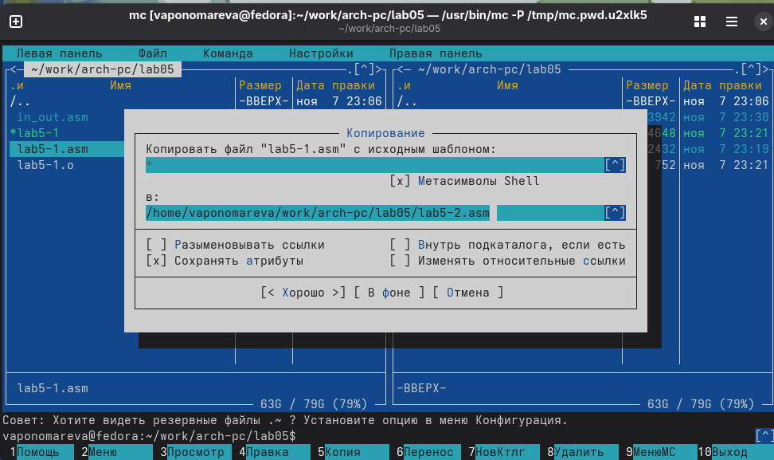{#fig-010 width=70%}

Проверяем, что файл создался. ([рис. @fig-011]).

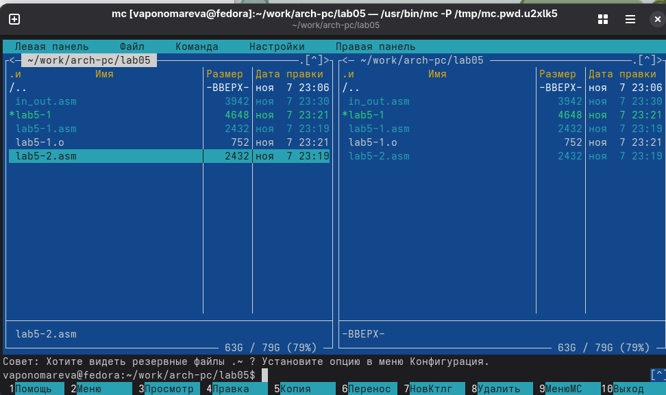{#fig-011 width=70%}

Исправим текст программы в файле lab5-2.asm и заполним в соответствии с заданием. ([рис. @fig-012]).

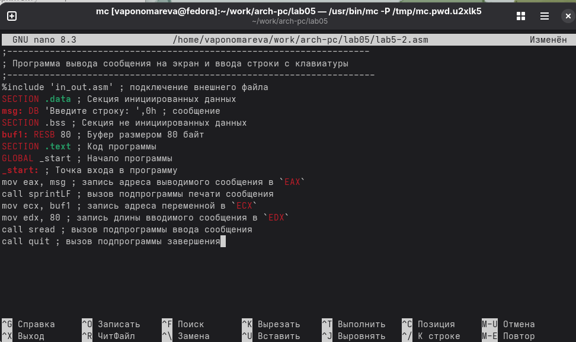{#fig-012 width=70%}

Оттранслируем текст программы lab5-2.asm в объектный файл и выполним компо-
новку объектного файла и запустим получившийся исполняемый файл. ([рис. @fig-013]).

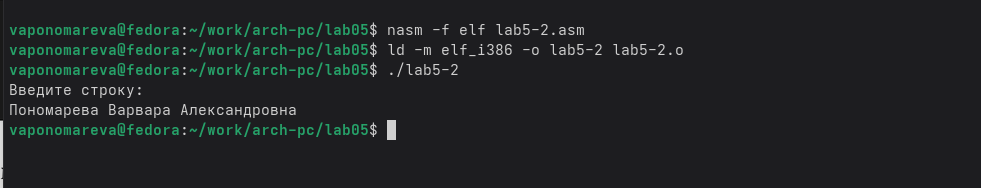{#fig-013 width=70%}

Открываем файл и меняем sprintLF на sprint. ([рис. @fig-014]).

{#fig-014 width=70%}

Снова оттранслируем текст программы lab5-2.asm в объектный файл. ([рис. @fig-015]).

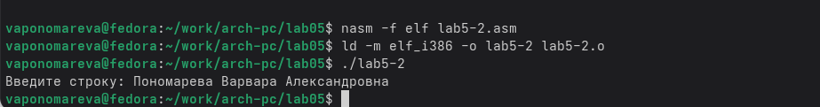{#fig-015 width=70%}

Команда sprint выводит текст в той же строке, а sprintLF позволяет переносить его на новую строку.

## Задание для самостоятельной работы

Создаем копию файла lab5-1.asm и называем его lab5-1_2.asm. ([рис. @fig-016]).

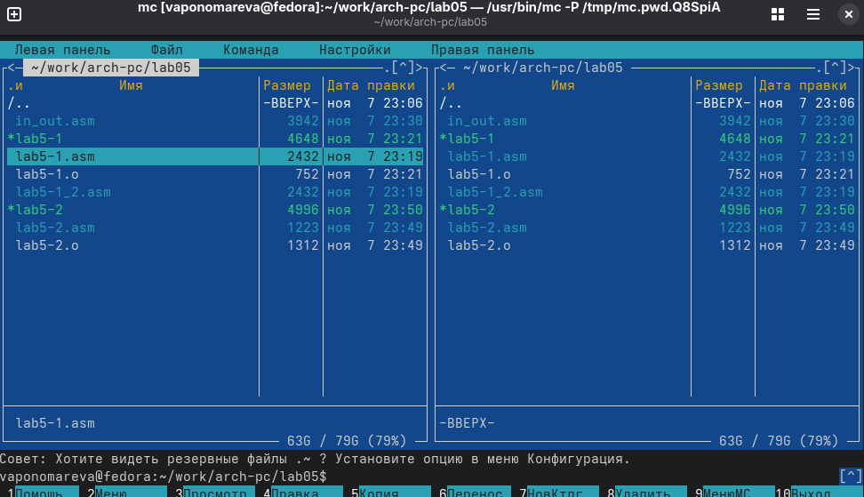{#fig-016 width=70%}

Редактируем файл, чтобы введеный текст с клавиатуры выводился в консоль. ([рис. @fig-017]).

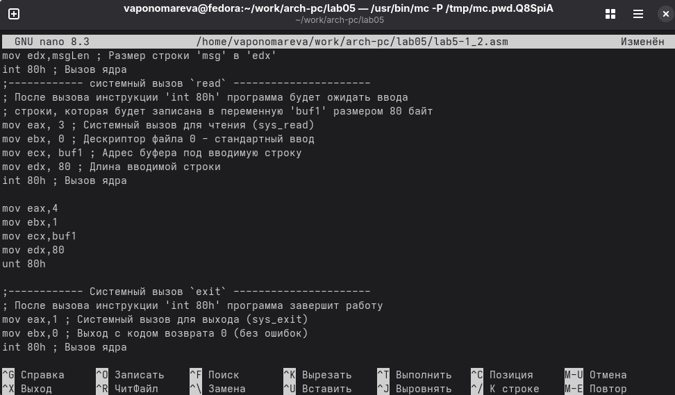{#fig-017 width=70%}

Оттранслируем текст программы lab5-1_2.asm в объектный файл и выполним компо-
новку объектного файла и запустим получившийся исполняемый файл. ([рис. @fig-018]).

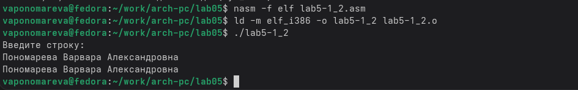{#fig-018 width=70%}

Создаем копию файла lab5-2.asm и называем его lab5-2_1.asm. ([рис. @fig-019]).

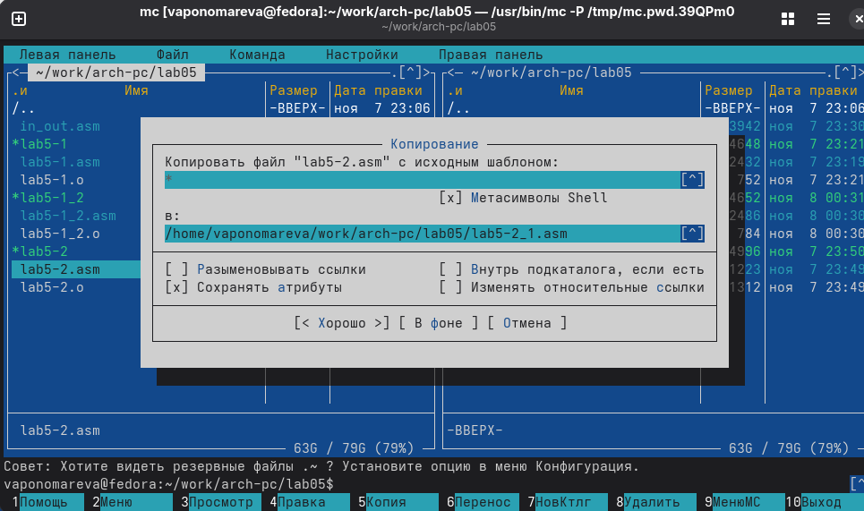{#fig-019 width=70%}

Редактируем файл, чтобы введеный текст с клавиатуры выводился в консоль. ([рис. @fig-020]).

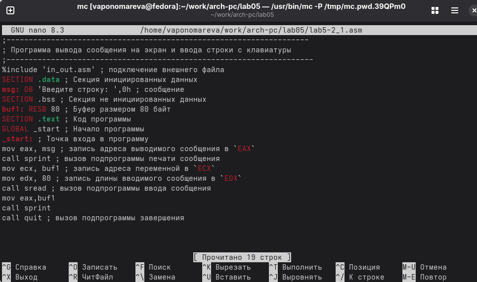{#fig-020 width=70%}

Снова оттранслируем текст программы lab5-2_1.asm в объектный файл и заупстим получившийся исполняемый файл. ([рис. @fig-021]).

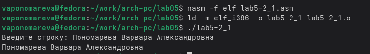{#fig-021 width=70%}

# Выводы

Мы приобрели практические навыки работы в Midnight Commander и освоили инструкции
языка ассемблера mov и int.
