---
## Front matter
title: "Отчёта по лабораторной работе №6"
subtitle: "Арифметические операции в NASM."
author: "Пономарева Варвара Александровна"

## Generic otions
lang: ru-RU
toc-title: "Содержание"

## Bibliography
bibliography: bib/cite.bib
csl: _resources/csl/gost-r-7-0-5-2008-numeric.csl

## Pdf output format
toc: true # Table of contents
toc-depth: 2
lof: true # List of figures
lot: false
fontsize: 12pt
linestretch: 1.5
papersize: a4
documentclass: scrreprt
## I18n polyglossia
polyglossia-lang:
  name: russian
  options:
   - spelling=modern
   - babelshorthands=true
polyglossia-otherlangs:
  name: english
## I18n babel
babel-lang: russian
babel-otherlangs: english
## Fonts
mainfont: Liberation Serif
sansfont: Liberation Sans
monofont: Liberation Mono
mainfontoptions: Ligatures=TeX
romanfontoptions: Ligatures=TeX
sansfontoptions: Ligatures=TeX,Scale=MatchLowercase
monofontoptions: Scale=MatchLowercase,Scale=0.9
## Biblatex
biblatex: true
biblio-style: "gost-numeric"
biblatexoptions:
  - parentracker=true
  - backend=biber
  - hyperref=auto
  - language=auto
  - autolang=other*
  - citestyle=gost-numeric
## Pandoc-crossref LaTeX customization
figureTitle: "Рис."
listingTitle: "Листинг"
lofTitle: "Список иллюстраций"
lolTitle: "Листинги"
## Misc options
indent: true
header-includes:
  - \usepackage{indentfirst}
  - \usepackage{float} # keep figures where there are in the text
  - \floatplacement{figure}{H} # keep figures where there are in the text
---
# Цель работы

Освоить арифметических инструкций языка ассемблера NASM.

# Задание

Написать несколько программ для решения необходимых выражений.

# Выполнение лабораторной работы

## Cимвольные и численные данные в NASM

Создадим каталог для программам лабораторной работы № 6, перейдем в него и
создадим файл lab6-1.asm ([рис. @fig-001]).

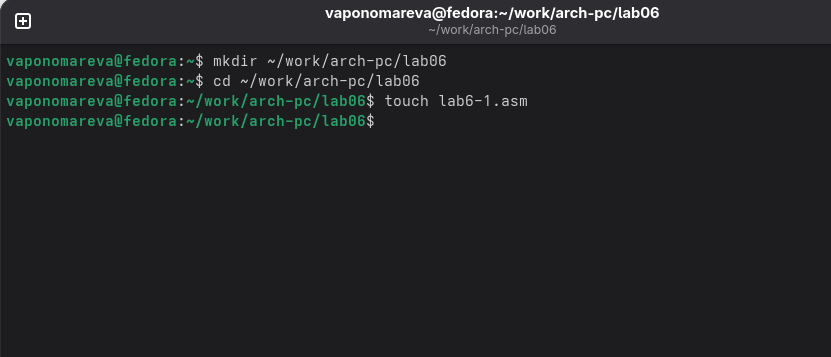{#fig-001 width=70%}

Введем в файл lab6-1.asm текст программы из листинга 6.1. ([рис. @fig-002]).

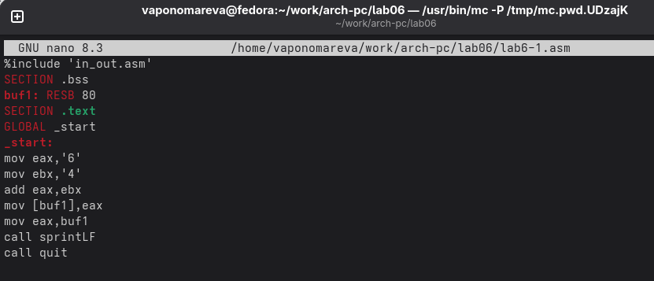{#fig-002 width=70%}

Создаем исполняемый файл и запускаем его. ([рис. @fig-003]).

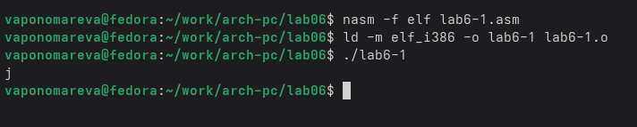{#fig-003 width=70%}

Далее изменим текст программы и вместо символов, запишем в регистры числа. Ис-
правим текст программы. ([рис. @fig-004]).

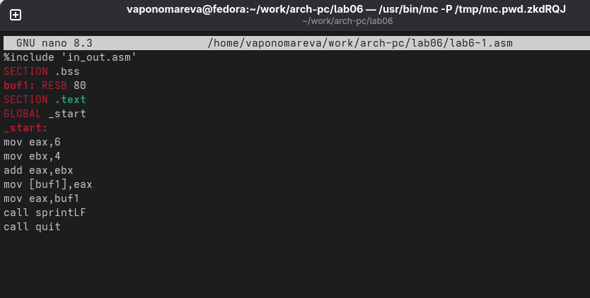{#fig-004 width=70%}

Создаем исполняемый файл и запускаем его. ([рис. @fig-005]).

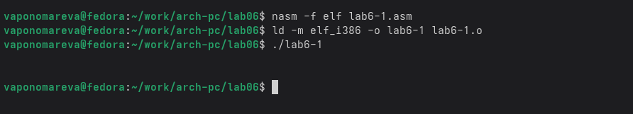{#fig-005 width=70%}

Создадим файл lab6-2.asm в каталоге ~/work/arch-pc/lab06. ([рис. @fig-006]).

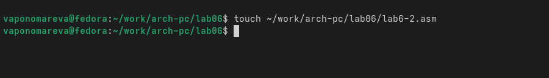{#fig-006 width=70%}

Введите в него текст программы из листинга 6.2. ([рис. @fig-007]).

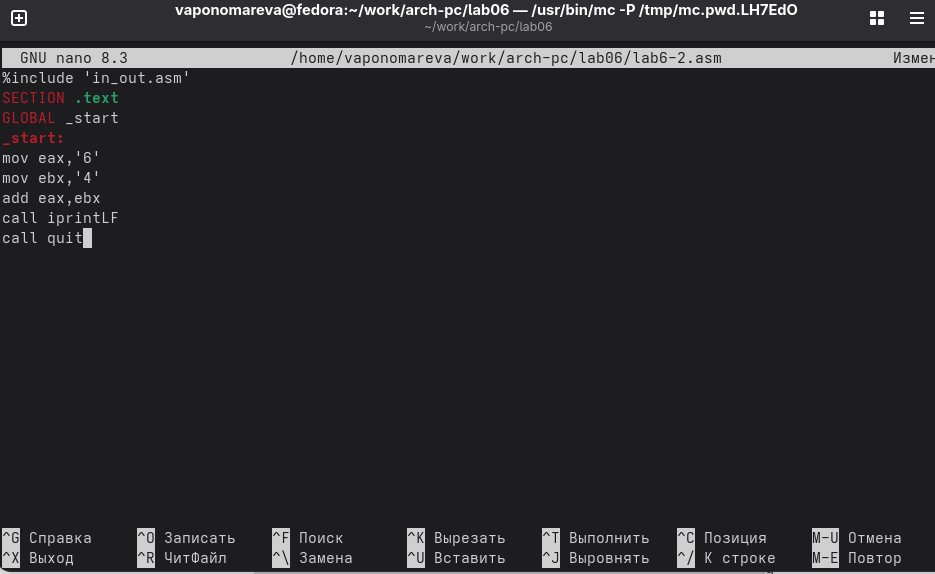{#fig-007 width=70%}

Создаем исполняемый файл и запускаем его. ([рис. @fig-008]).

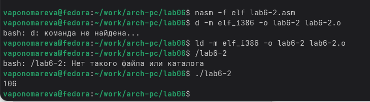{#fig-008 width=70%}

Снова открываем файл для редактирования и убиравем кавычки с числовых значений. ([рис. @fig-009]).

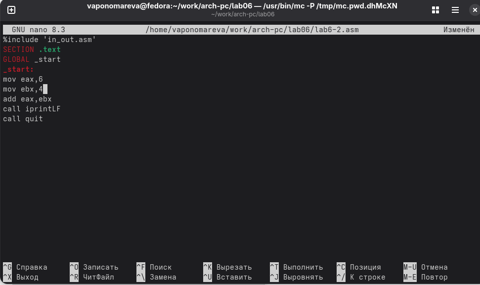{#fig-009 width=70%}

Создаем исполняемый файл и запускаем его. ([рис. @fig-010]).

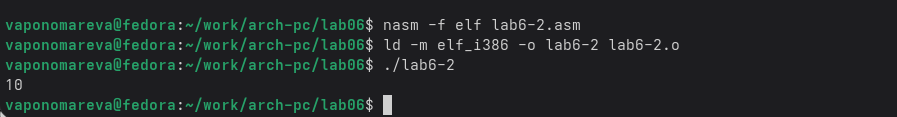{#fig-010 width=70%}

Заменим функцию iprintLF на iprint. ([рис. @fig-011]).

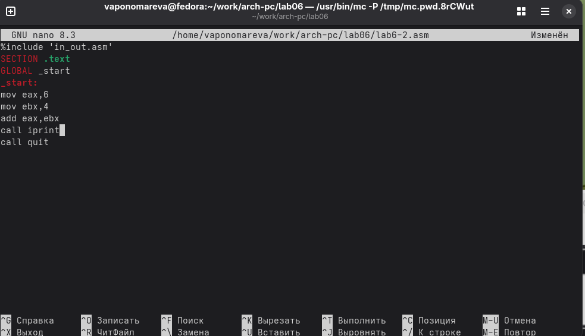{#fig-011 width=70%}

Создаем исполняемый файл и запускаем его. ([рис. @fig-012]).

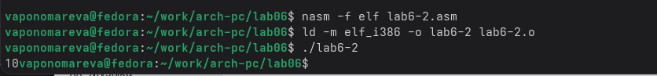{#fig-012 width=70%}

Вывод функций iprintLF и iprint отличаются только тем, что LF переносит на новую строку.

## Выполнение арифметических операций в NASM

Создадим файл lab6-3.asm в каталоге ~/work/arch-pc/lab06. ([рис. @fig-013]).

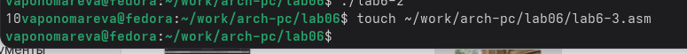{#fig-013 width=70%}

Открываем файл и редактируем в соответствии с листингом 6.3. ([рис. @fig-014]).

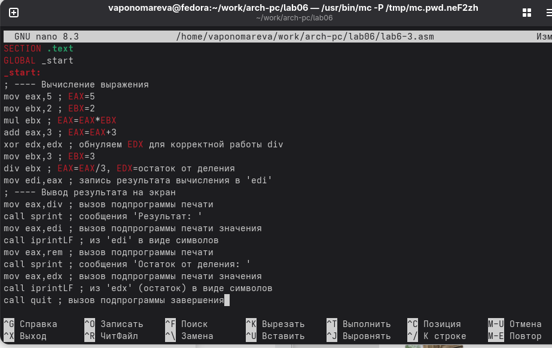{#fig-014 width=70%}

Создаем исполняемый файл и запускаем его. ([рис. @fig-015]).

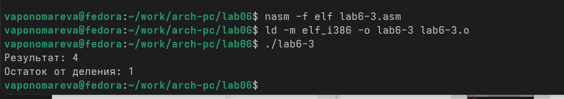{#fig-015 width=70%}

Изменим текст программы для вычисления выражения 𝑓(𝑥) = (4 ∗ 6 + 2)/5. ([рис. @fig-016]).

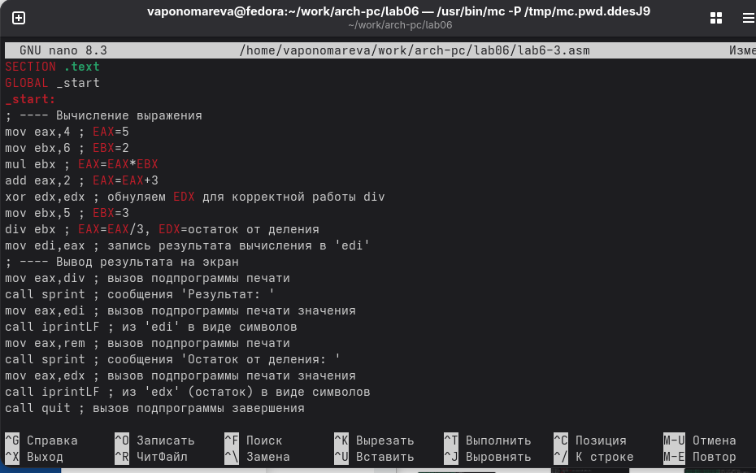{#fig-016 width=70%}

Создаем исполняемый файл и запускаем его. ([рис. @fig-017]).

{#fig-017 width=70%}

Создаем файл variant.asm в каталоге ~/work/arch-pc/lab06. ([рис. @fig-018]).

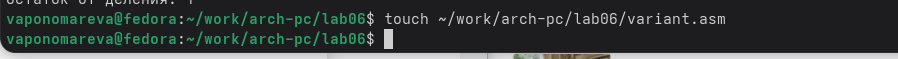{#fig-018 width=70%}

Открываем файл и редактируем в соответствии с листингом 6.4. ([рис. @fig-019]).

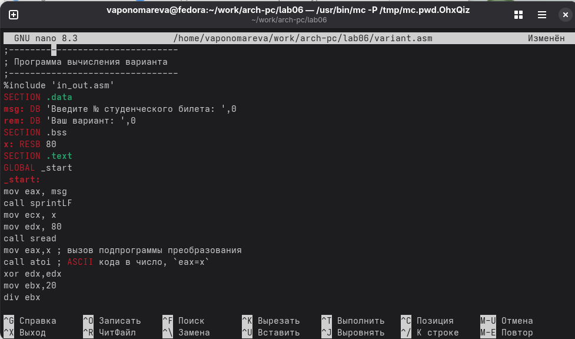{#fig-019 width=70%}

Создаем исполняемый файл и запускаем его. ([рис. @fig-020]).

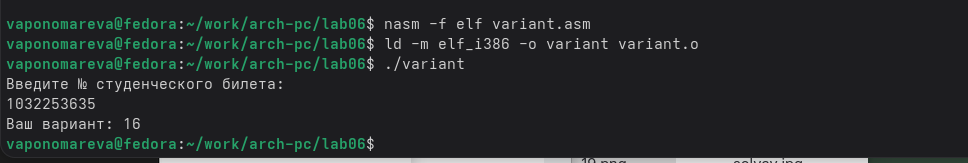{#fig-020 width=70%}

## Ответы на вопросы по программе

1. Строки, отвечающие за вывод сообщения 'Ваш вариант:' - mov eax,rem и call sprint. Где rem - это переменная, определенная как: rem: DB 'Ваш вариант: ',0

2. Назначение инструкций: mov ecx, x - загрузка адреса буфера x в регистр ecx, mov edx, 80 - указание максимальной длины ввода (80 символов), call sread - вызов функции чтения строки с клавиатуры. Эти инструкции используются для ввода номера студенческого билета с клавиатуры.

3. Назначение инструкции "call atoi" - преобразует ASCII-коды символов, введенных с клавиатуры, в целое число. Результат преобразования записывается в регистр eax.

4. Строки, отвечающие за вычисление варианта: xor edx,edx - обнуление edx для корректной работы div, mov ebx,20 - загрузка делителя 20 в ebx, div ebx - деление eax на ebx (eax = eax / 20), inc edx - увеличение остатка на 1 (edx = edx + 1).

5. При выполнении инструкции "div ebx" остаток от деления записывается в регистр edx.

6. Инструкция "inc edx" увеличивает значение в регистре edx на 1. Так как при делении на 20 в edx находится остаток от 0 до 19, то inc edx преобразует этот диапазон в 1-20, что соответствует номеру варианта.

7. Строки, отвечающие за вывод результата вычислений: mov eax,edx - загрузка номера варианта из edx в eax, call iprintLF - вывод числа на экран с переводом строки.

## Задание для самостоятельной работы

Создаем новый файл lab6-4.asm в каталоге ~/work/arch-pc/lab06. ([рис. @fig-021]).

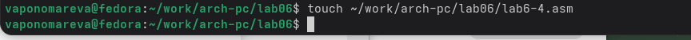{#fig-021 width=70%}

Открываем его и заполняем, чтобы решалось выражение f(x)=(10*x-5)^2. ([рис. @fig-022]).

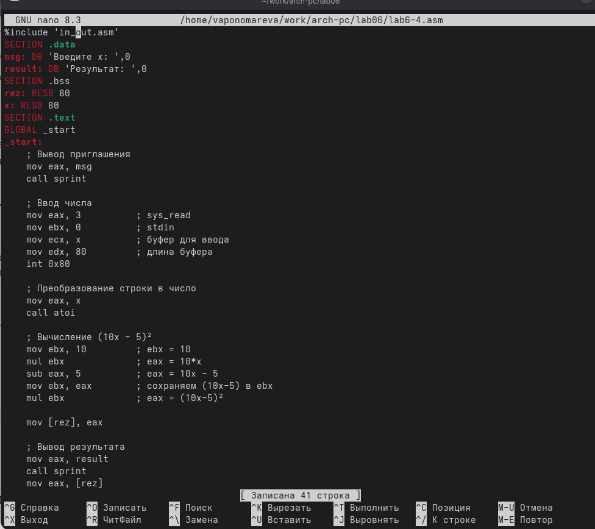{#fig-022 width=70%}

Создаем исполняемый файл и запускаем его для х=3. ([рис. @fig-023]).

{#fig-023 width=70%}

Создаем исполняемый файл и запускаем его для х=1. ([рис. @fig-024]).

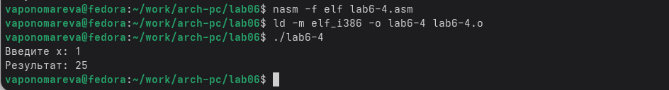{#fig-024 width=70%}

# Выводы

Мы приобрели навыки создания исполнительных файлов для решения выражений и освоили арифметические инструкции в NASM.
