---
## Front matter
title: "Отчёта по лабораторной работе №7"
subtitle: "Команды безусловного и условного переходов в Nasm. Программирование ветвлений."
author: "Пономарева Варвара Александровна"

## Generic otions
lang: ru-RU
toc-title: "Содержание"

## Bibliography
bibliography: bib/cite.bib
csl: _resources/csl/gost-r-7-0-5-2008-numeric.csl

## Pdf output format
toc: true # Table of contents
toc-depth: 2
lof: true # List of figures
lot: false
fontsize: 12pt
linestretch: 1.5
papersize: a4
documentclass: scrreprt
## I18n polyglossia
polyglossia-lang:
  name: russian
  options:
   - spelling=modern
   - babelshorthands=true
polyglossia-otherlangs:
  name: english
## I18n babel
babel-lang: russian
babel-otherlangs: english
## Fonts
mainfont: Liberation Serif
sansfont: Liberation Sans
monofont: Liberation Mono
mainfontoptions: Ligatures=TeX
romanfontoptions: Ligatures=TeX
sansfontoptions: Ligatures=TeX,Scale=MatchLowercase
monofontoptions: Scale=MatchLowercase,Scale=0.9
## Biblatex
biblatex: true
biblio-style: "gost-numeric"
biblatexoptions:
  - parentracker=true
  - backend=biber
  - hyperref=auto
  - language=auto
  - autolang=other*
  - citestyle=gost-numeric
## Pandoc-crossref LaTeX customization
figureTitle: "Рис."
listingTitle: "Листинг"
lofTitle: "Список иллюстраций"
lolTitle: "Листинги"
## Misc options
indent: true
header-includes:
  - \usepackage{indentfirst}
  - \usepackage{float} # keep figures where there are in the text
  - \floatplacement{figure}{H} # keep figures where there are in the text
---
# Цель работы

Изучить команды условного и безусловного переходов. Приобрести навыки написания
программ с использованием переходов. Ознакомиться с назначением и структурой файла
листинга.

# Задание

Написать несколько программ для решения необходимых выражений и систем.

# Выполнение лабораторной работы

## Реализация переходов в NASM

Создадим каталог для программам лабораторной работы № 7, перейдем в него и со-
здадим файл lab7-1.asm. ([рис. @fig-001]).

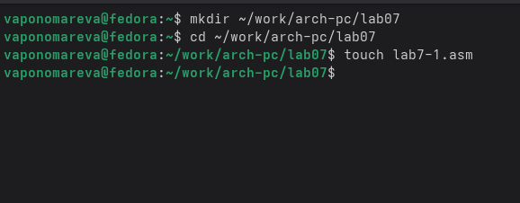{#fig-001 width=70%}

Введем в файл lab7-1.asm текст программы из листинга 7.1. ([рис. @fig-002]).

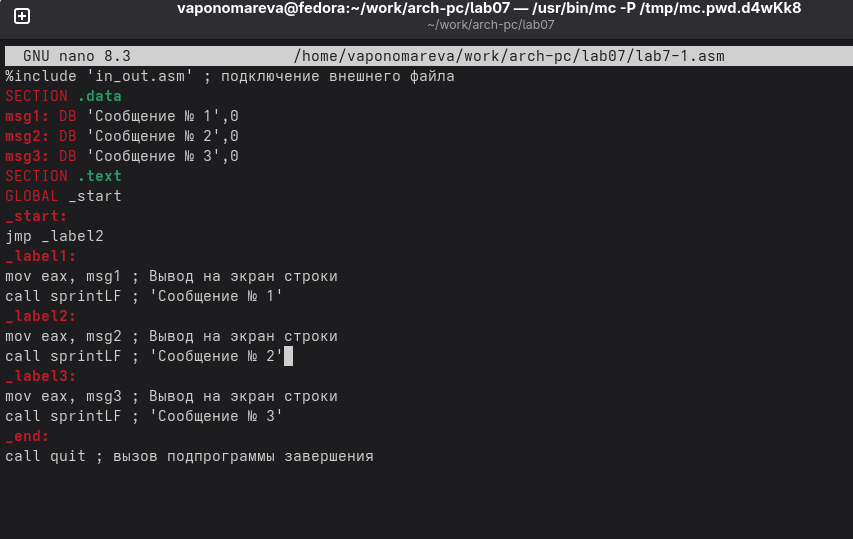{#fig-002 width=70%}

Создаем исполняемый файл и запускаем его. ([рис. @fig-003]).

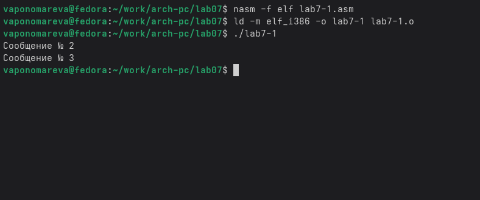{#fig-003 width=70%}

Снова открываем файл для редактирования и изменяем его в соответствии с листингом 7.2, чтобы она выводила сначала ‘Сообщение № 2’, потом ‘Сообщение № 1’ и завершала работу. ([рис. @fig-004]).

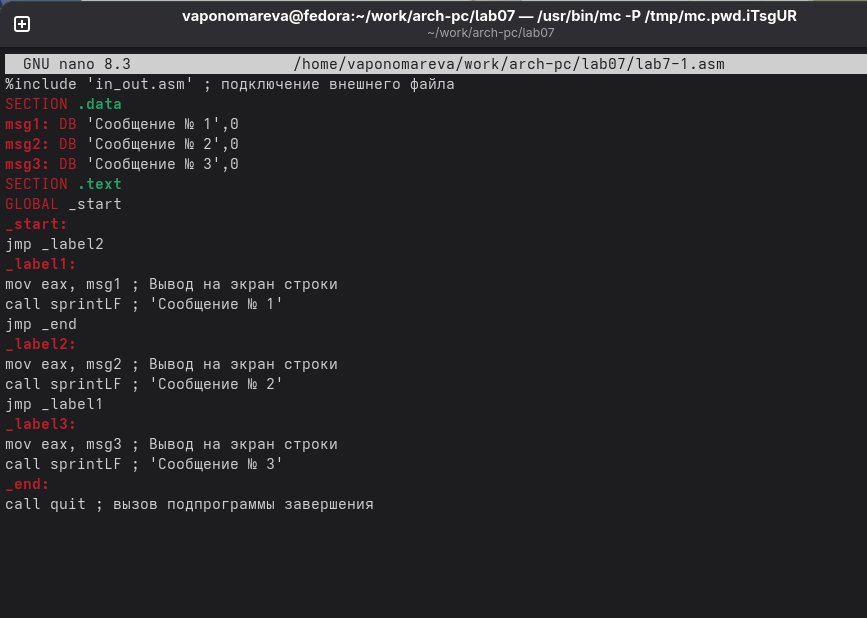{#fig-004 width=70%}

Создаем исполняемый файл и запускаем его. ([рис. @fig-005]).

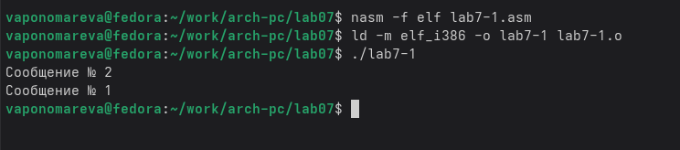{#fig-005 width=70%}

Изменим текст программы добавив или изменив инструкции jmp, чтобы она выводила сначала ‘Сообщение № 3’, потом ‘Сообщение № 2’, потом ‘Сообщение № 1’ и завершала работу . ([рис. @fig-006]).

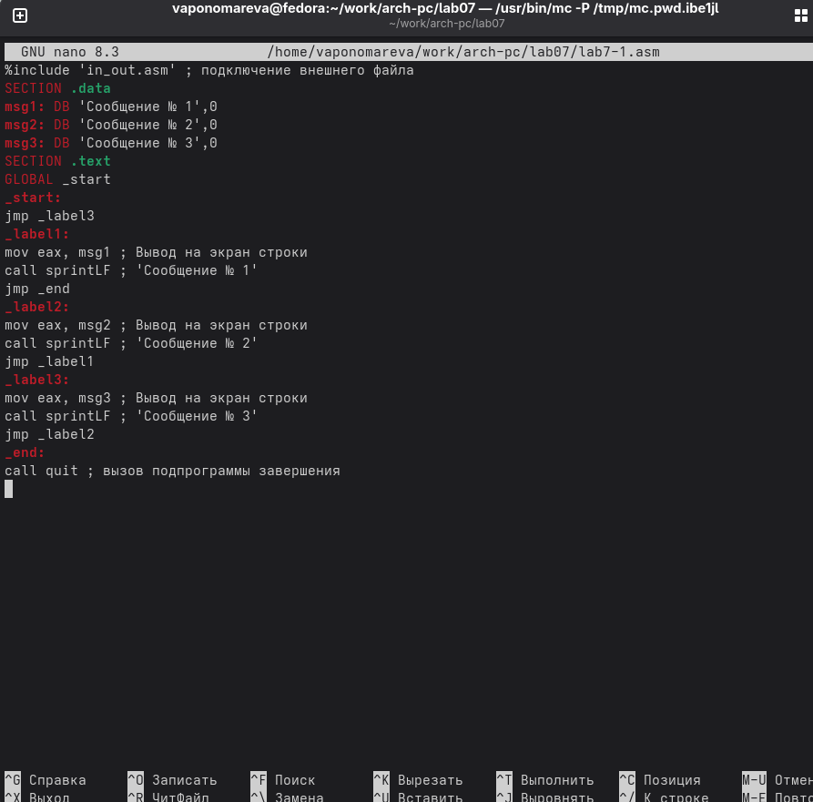{#fig-006 width=70%}

Создаем исполняемый файл и запускаем его. ([рис. @fig-007]).

{#fig-007 width=70%}

Создадим файл lab7-2.asm в каталоге ~/work/arch-pc/lab07. ([рис. @fig-008]).

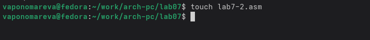{#fig-008 width=70%}

Открываем файл в Midnight Commander и заполняем его в соответствии с листингом 7.3. ([рис. @fig-009]).

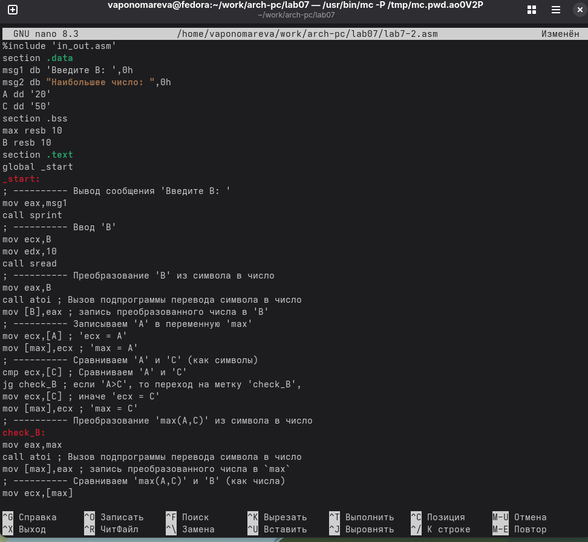{#fig-009 width=70%}

Создаем исполняемый файл и запускаем его и проверяем, вводя разные значения B. ([рис. @fig-010]).

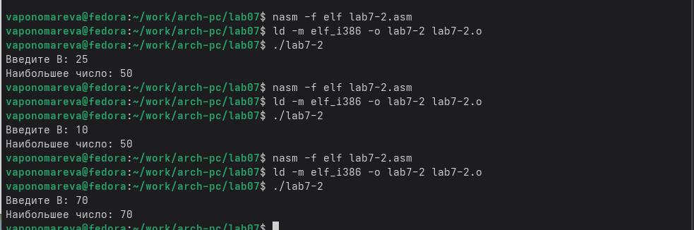{#fig-010 width=70%}

## Изучение структуры файлы листинга

Создайте файл листинга для программы из файла lab7-2.asm, указав ключ -l и задав имя файла листинга в командной строке. ([рис. @fig-011]).

{#fig-011 width=70%}

Откройте файл листинга lab7-2.lst с помощью mcedit и внимательно ознакомимся с содержимым. ([рис. @fig-012]).

{#fig-012 width=70%}

Строка 14: 0000000B - адрес в памяти, 29D8 - машинный код команды sub eax,ebx; sub eax, ebx - вычисляет длину строкы как разницу между конечным и начальным адресом.

Строка 15: 0000000D - адрес в памяти, 5B - машинный код команды pop ebx,pop - извлечение значения из стека, ebx - регистр, в который восстанавливается значение, восстановление исходного значения регистра EBX, которое было сохранено в стеке командой push ebx в строке 4.

Строка 16: 0000000E - адрес в памяти, C3 - машинный код команды ret, ret - возвращает управление вызывающей программе, завершая работу функции.

Откроем файл с программой lab7-2.asm и в любой инструкции с двумя операндами удалим один операнд. ([рис. @fig-013]).

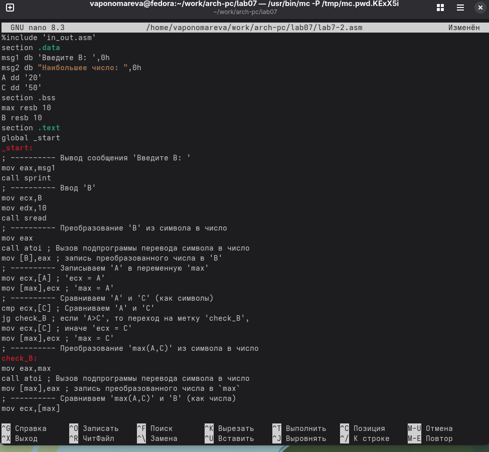{#fig-013 width=70%}

Выполним трансляцию с получением файла листинга. ([рис. @fig-014]).

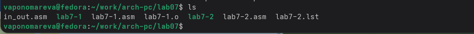{#fig-014 width=70%}

При трансляции файла, выдается ошибка, но создаются исполнительный файл lab7-2 и lab7-2.lst

Снова открываем файл листинга и изучаем его. ([рис. @fig-015]).

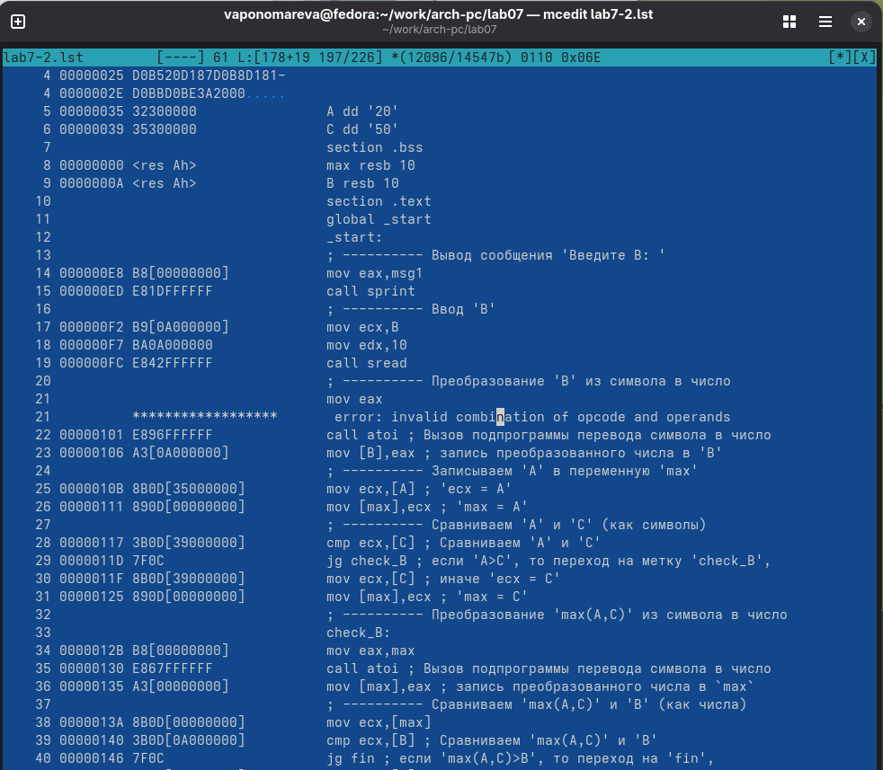{#fig-015 width=70%}

## Задание для самостоятельной работы

ВАРИАНТ-16

1. Напишите программу нахождения наименьшей из 3 целочисленных переменных a,b и c.Значения переменных выбрать из табл. 7.5 в соответствии с вариантом, полученнымпри выполнении лабораторной работы № 6. Создайте исполняемый файл и проверьте его работу.

Создаем новый файл lab7-3.asm. ([рис. @fig-016]).

{#fig-016 width=70%}

Открываем его и пишем программу, которая выберет наименьшее число из трех. ([рис. @fig-017]).

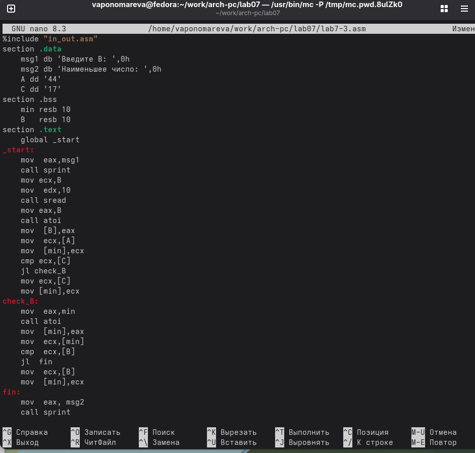{#fig-017 width=70%}

Транслируем файл и смотрим на работу программы. ([рис. @fig-018]).

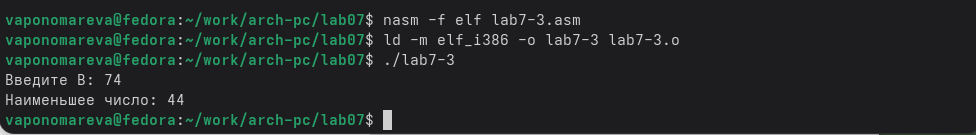{#fig-018 width=70%}

2. Напишите программу, которая для введенных с клавиатуры значений x и a вычисляет значение заданной функции f(x) и выводит результат вычислений. Вид функции f(x) выбрать из таблицы 7.6 вариантов заданий в соответствии с вариантом, полученным при выполнении лабораторной работы № 6. Создайте исполняемый файл и проверьте его работу для значений x и a из 7.6.

Создаем новый файл lab7-4.asm. ([рис. @fig-019]).

{#fig-019 width=70%}

Открываем его и пишем программу, которая решит систему уравнений, при даных, введенных в консоль. ([рис. @fig-020]).

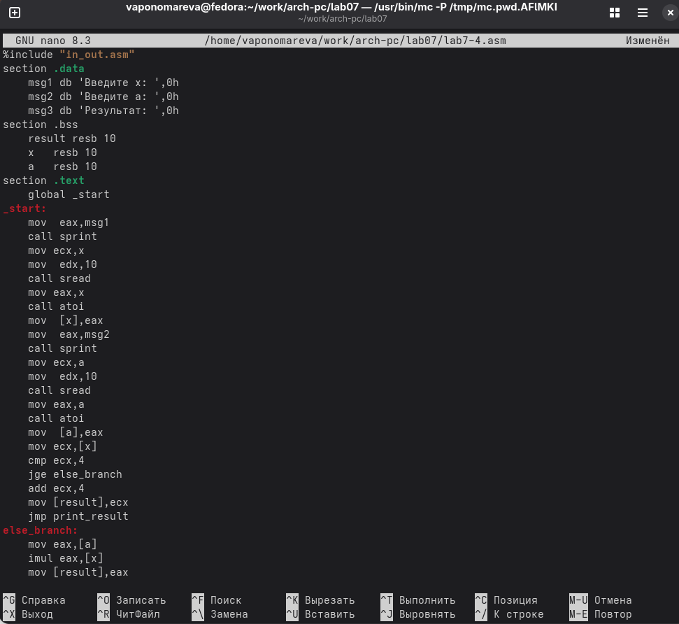{#fig-020 width=70%}

Транслируем файл и проверяем его работу при x=1 и а=1,а также при х=7 и а=1. ([рис. @fig-021]).

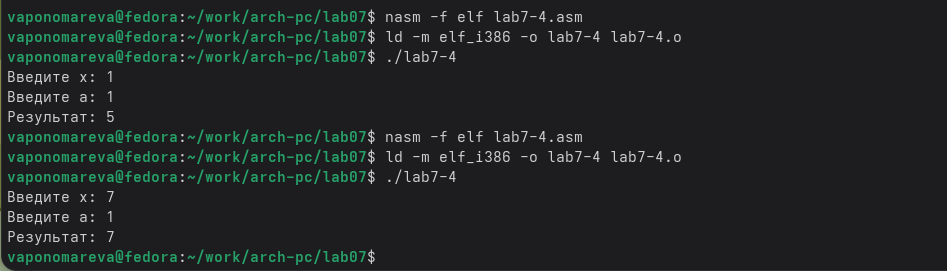{#fig-021 width=70%}

# Выводы

Мы познакомились с структурой файла листинга, изучили команды условного и безусловного перехода.
