---
## Front matter
title: "Отчёта по лабораторной работе №8"
subtitle: "Программирование цикла. Обработка аргументов командной строки."
author: "Пономарева Варвара Александровна"

## Generic otions
lang: ru-RU
toc-title: "Содержание"

## Bibliography
bibliography: bib/cite.bib
csl: _resources/csl/gost-r-7-0-5-2008-numeric.csl

## Pdf output format
toc: true # Table of contents
toc-depth: 2
lof: true # List of figures
lot: false
fontsize: 12pt
linestretch: 1.5
papersize: a4
documentclass: scrreprt
## I18n polyglossia
polyglossia-lang:
  name: russian
  options:
   - spelling=modern
   - babelshorthands=true
polyglossia-otherlangs:
  name: english
## I18n babel
babel-lang: russian
babel-otherlangs: english
## Fonts
mainfont: Liberation Serif
sansfont: Liberation Sans
monofont: Liberation Mono
mainfontoptions: Ligatures=TeX
romanfontoptions: Ligatures=TeX
sansfontoptions: Ligatures=TeX,Scale=MatchLowercase
monofontoptions: Scale=MatchLowercase,Scale=0.9
## Biblatex
biblatex: true
biblio-style: "gost-numeric"
biblatexoptions:
  - parentracker=true
  - backend=biber
  - hyperref=auto
  - language=auto
  - autolang=other*
  - citestyle=gost-numeric
## Pandoc-crossref LaTeX customization
figureTitle: "Рис."
listingTitle: "Листинг"
lofTitle: "Список иллюстраций"
lolTitle: "Листинги"
## Misc options
indent: true
header-includes:
  - \usepackage{indentfirst}
  - \usepackage{float} # keep figures where there are in the text
  - \floatplacement{figure}{H} # keep figures where there are in the text
---
# Цель работы

Приобрести навыки написания программ с использованием циклов и обработкой
аргументов командной строки.

# Задание

Написать программы с использованием циклов и обработкой аргументов командной строки.

# Выполнение лабораторной работы

## Реализация циклов в NASM

Создадим каталог для программам лабораторной работы № 8, перейдем в него и со-
здадим файл lab8-1.asm. ([рис. @fig-001]).

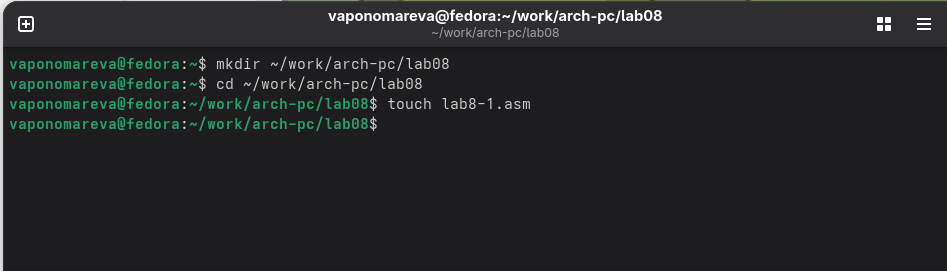{#fig-001 width=70%}

Открываем файл в Midnight Commander и заполняем его в соответствии с листингом 8.1 ([рис. @fig-002]).

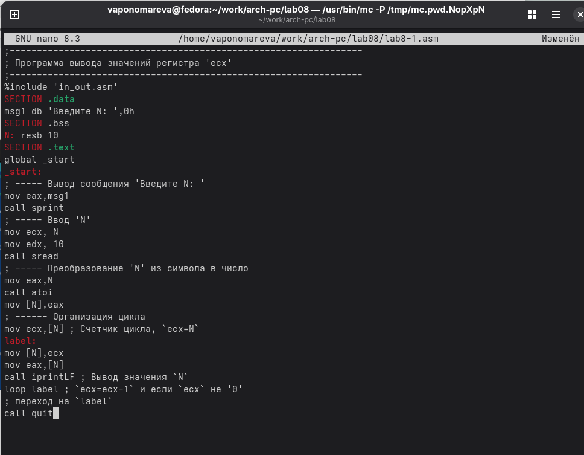{#fig-002 width=70%}

Создаем исполняемый файл и запускаем его. ([рис. @fig-003]).

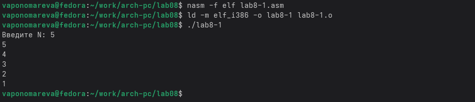{#fig-003 width=70%}

Снова открываем файл для редактирования и изменяем его, добавив изменение значения регистра в цикле. ([рис. @fig-004]).

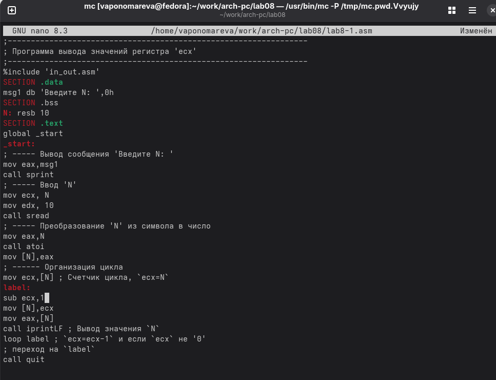{#fig-004 width=70%}

Создаем исполняемый файл и запускаем его. ([рис. @fig-005]).

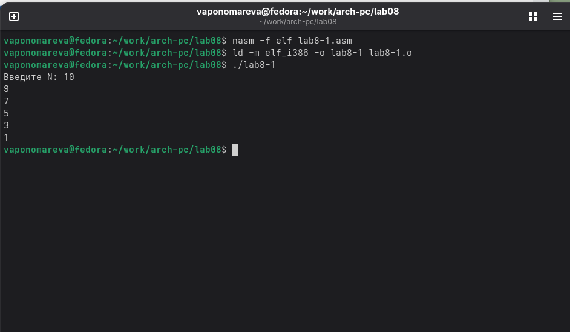{#fig-005 width=70%}

В исходной программе регистр ecx принимает значения от N до 1, и число проходов цикла полностью соответствует введенному значению N. В измененной версии, где добавлена инструкция sub ecx,1 перед loop, регистр ecx уменьшается на два за каждую итерацию, что приводит к несоответствию числа проходов цикла значению N.

Снова открываем файл для редактирования и изменяем его, чтобы все корректно работало. ([рис. @fig-006]).

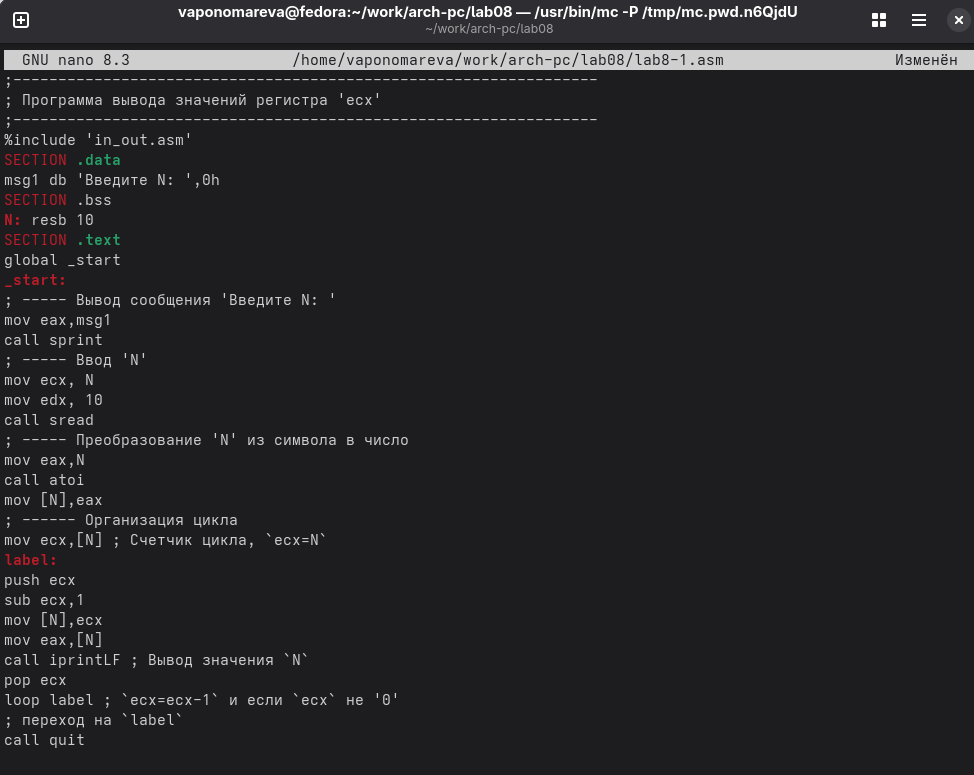{#fig-006 width=70%}

Создаем исполняемый файл и запускаем его. ([рис. @fig-007]).

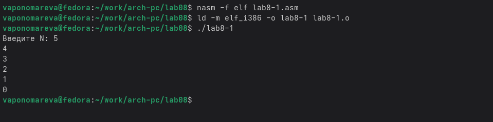{#fig-007 width=70%}

В данном случае число проходов цикла равна числу N.

## Обработка аргументов командной строки.

Создадим файл lab8-2.asm в каталоге ~/work/arch-pc/lab08. ([рис. @fig-008]).

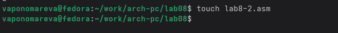{#fig-008 width=70%}

Открываем файл в Midnight Commander и заполняем его в соответствии с листингом 8.2 ([рис. @fig-009]).

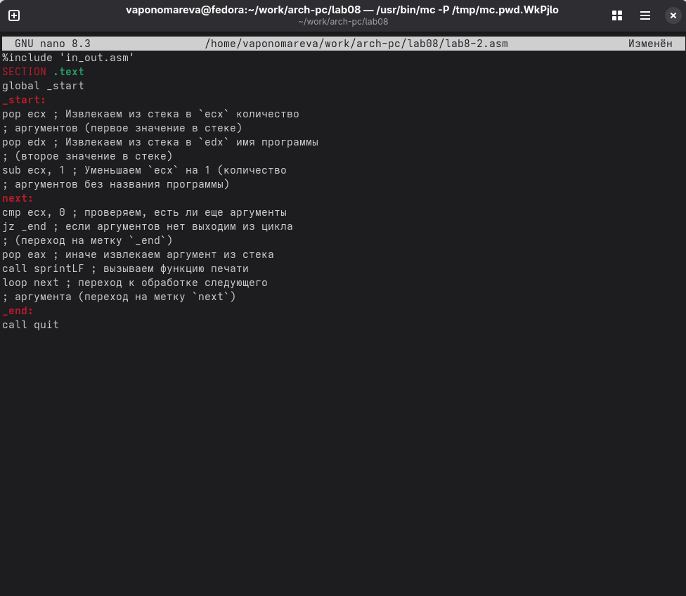{#fig-009 width=70%}

Создаем исполняемый файл и запускаем его и проверяем, что он работает правильно, указываем аргументы. ([рис. @fig-010]).

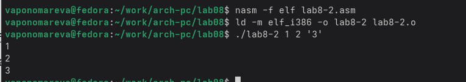{#fig-010 width=70%}

Програмой было обработано 3 аргумента.

Создадим файл lab8-3.asm в каталоге ~/work/arch-pc/lab08. ([рис. @fig-011]).

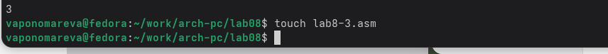{#fig-011 width=70%}

Открываем файл и заполняем его в соответствии с листингом 8.3. ([рис. @fig-012]).

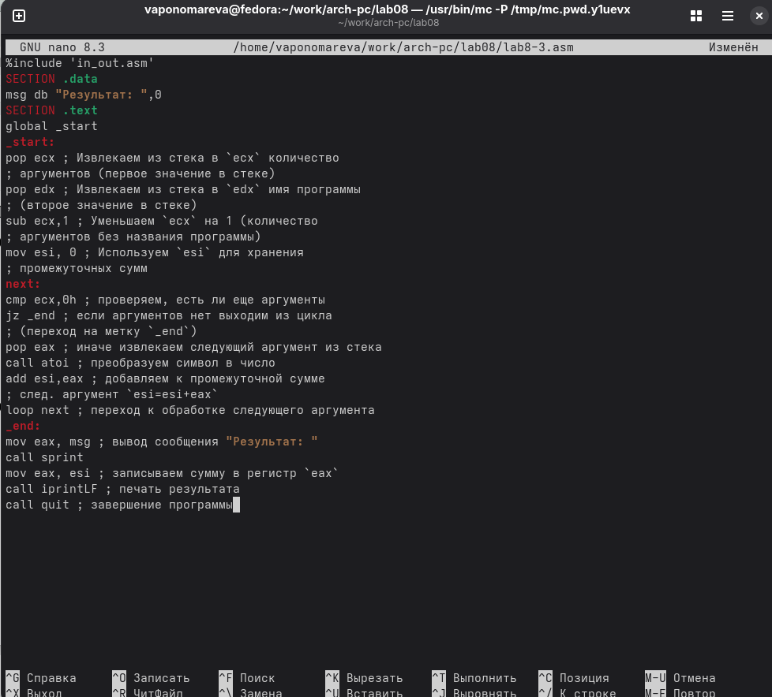{#fig-012 width=70%}

Создаём исполняемый файл и запускаем его, указав аргументы. ([рис. @fig-013]).

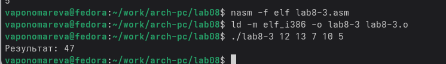{#fig-013 width=70%}

Снова открываем файл для редактирования и изменяем его, чтобы вычислялось произведение вводимых значений. ([рис. @fig-014]).

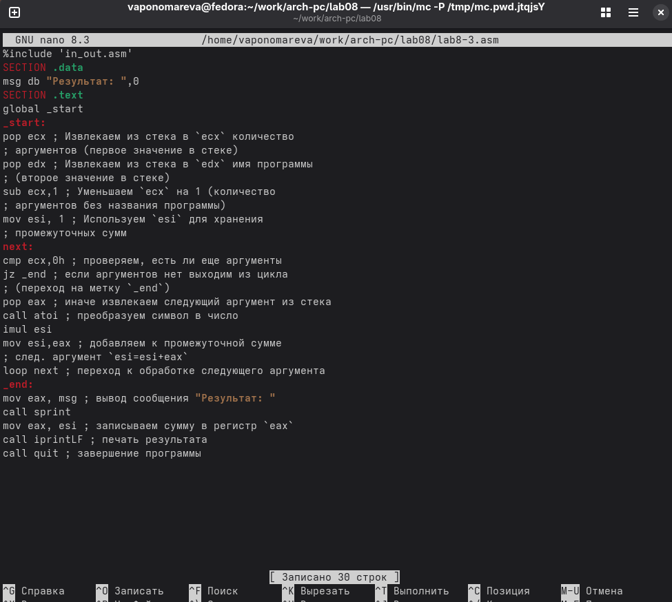{#fig-014 width=70%}

Создаём исполняемый файл и запускаем его, указав аргументы. ([рис. @fig-015]).

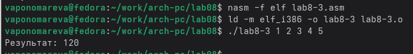{#fig-015 width=70%}

## Задание для самостоятельной работы

ВАРИАНТ-16

1. Напишите программу, которая находит сумму значений функции f(x) для x = x1, x2, ..., xn, т.е. программа должна выводить значение f(x1) + 𝑓(x2) + ... + f(x𝑛). Значения xi передаются как аргументы. Вид функции f(x) выбрать из таблицы 8.1 вариантов заданий в соответствии с вариантом, полученным при выполнении лабораторной работы № 6. Создайте исполняемый файл и проверьте его работу на нескольких наборах x = x1, x2, ..., xn.

Создаем новый файл lab8-4.asm. ([рис. @fig-016]).

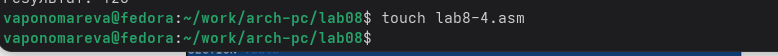{#fig-016 width=70%}

Открываем его и пишем программу, выведет сумму значений, получившихся после решения выражения 30*x-11. ([рис. @fig-017]).

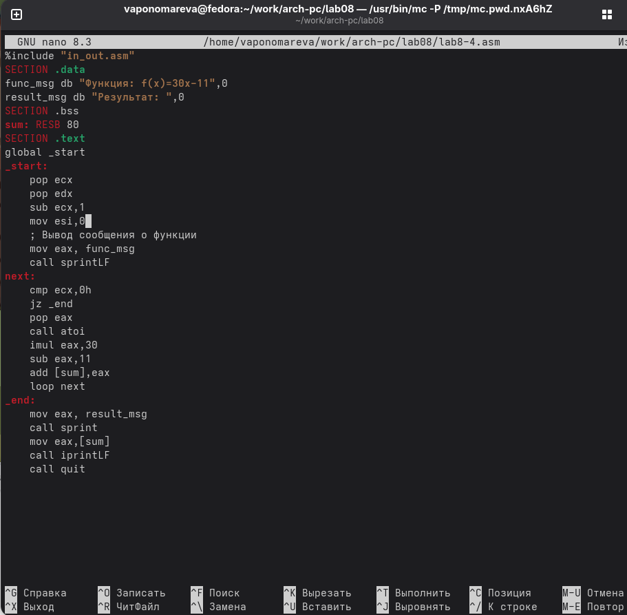{#fig-017 width=70%}

Транслируем файл и смотрим на работу программы при x1=1 x2=2 x3=3, x4=4. ([рис. @fig-018]).

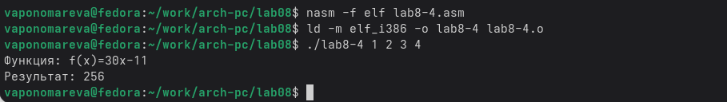{#fig-018 width=70%}

ранслируем файл и смотрим на работу программы при x1=5 x2=6 x3=7, x4=8. ([рис. @fig-019]).

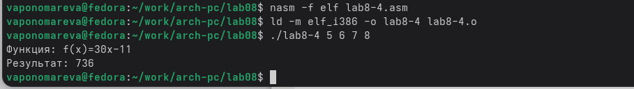{#fig-019 width=70%}

# Выводы

Мы научились решать программы с использованием циклов и обработкой аргументов командной строки.
